## IDS Project A5 Big Baby.
### Introduction
The goal of our project is to find factors, which predict fetal macrosomia. In other words, our aim is to find which attributes are linked to newborns, that are larger than 95% of all babies with the same gestation period. Our code can be found in this repository in the file named Project A5 Big Baby.ipynb.
The objective of this ReadMe is to give explanations to questions that may arise from code. Project uses following modules: pandas, sklearn, numpy, xgboos. For training the models the data file Pregnancy_data.csv is also required. 
### Cleaning data
Since the data file given to us was initally excel file, then it contained a lot of excesssive data. In this step, we got rid of duplicate data.
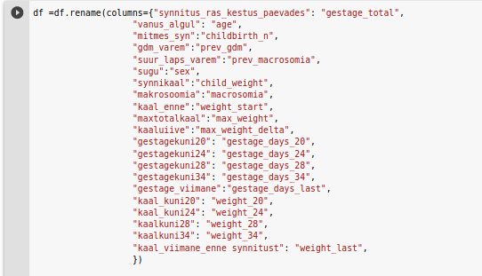

### Data preprocessing
Firstly, we translated all remaining attributes to English. 
  
Visualising the data.  
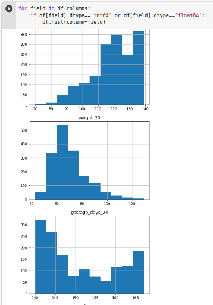  
Since some women were not weighed on their visits, then we interpolated their weights from their previous and next visit.  
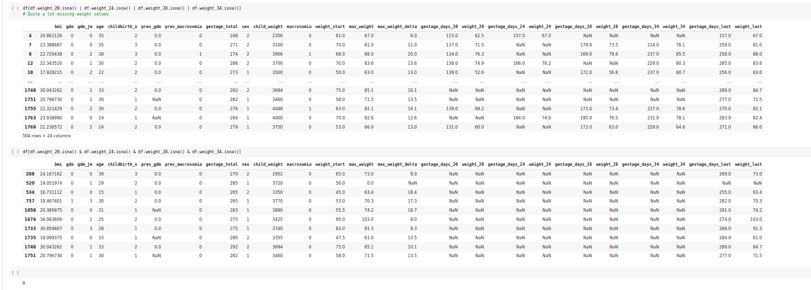  
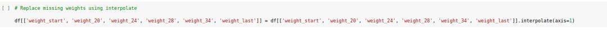  
Made new attributes for training. The thinking behind it is to check whether absolute difference or relative difference of weight predicts the result more accurately. 
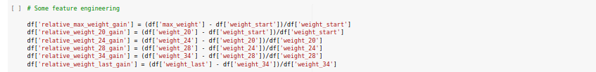 

### Training
Splitting the data into training set, testing set, validation set. Sizes: 70%-15%.15%. 
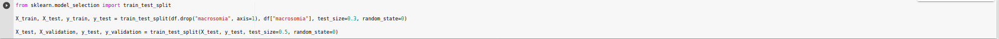  
For the first set of model we used minimal amount of features.
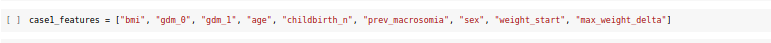  
For the second set of models we added some extra features to compare.
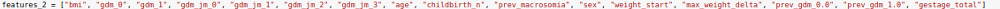  
We made a function that trains 5 different machine learning algorithms to find, which one suits this dataset the best.
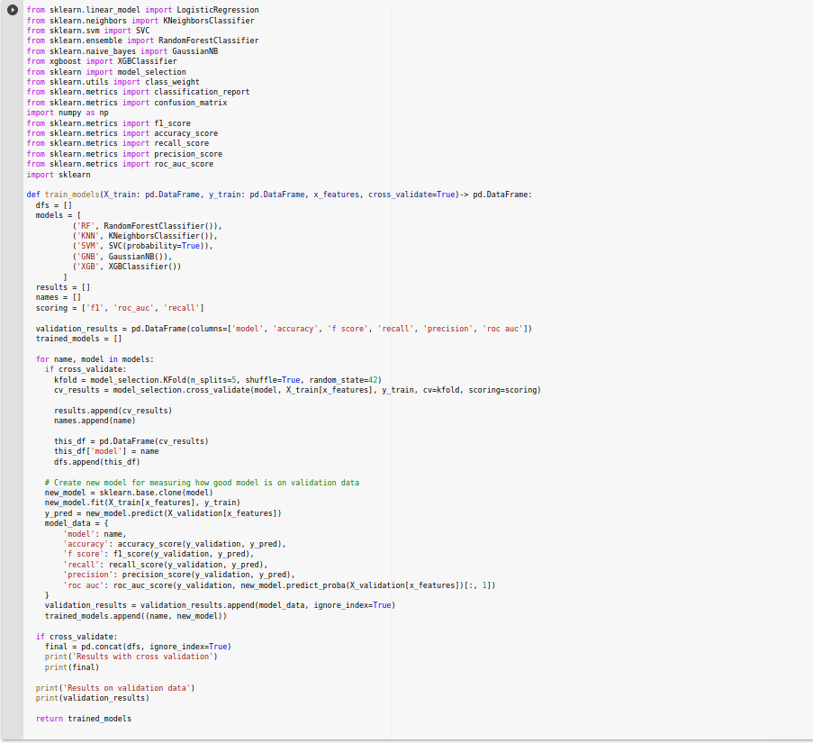  
Since 85% of our examples were negative, we tried to use undersampling to balance the sets.
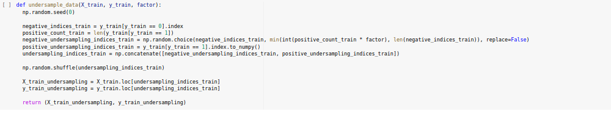  
We used 5 different ways to undersample the sets. The relation between negative and positive examples in these sets were 0.9, 1.2, 1.5, 1.8, 2.1
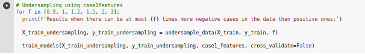  
Training models on undersampled data.  
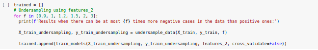  
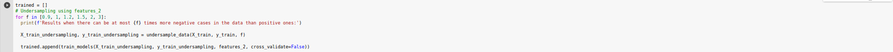  
One of our goals was to find out, how significant each attribute is in predicting macrosomia. So we looked at the best Random Tree Classifier model's feature importance.  
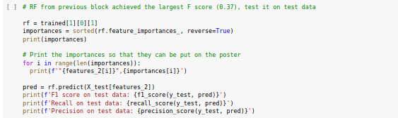  
Lastly, we wanted to know if adding even more features would improve accuracy. For that we replaced mother's total weight delta with data from each weighing.  
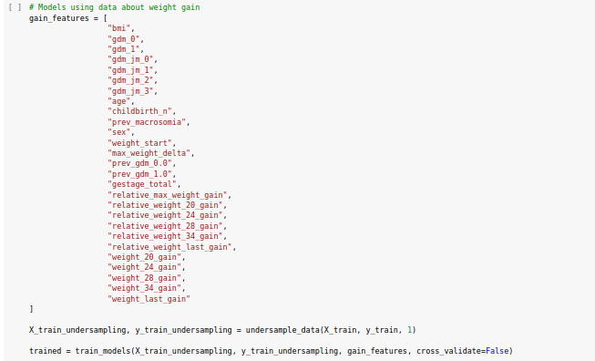  

